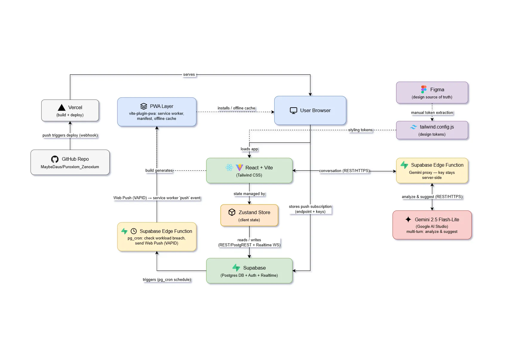

# [Zenoxium] by [Puroxiom]

**Team:** 
- Muhammad Firdaus 
- Siti Nur Syazwani Khong

- **Problem Statement:** [Stress & Workload Manager / Travel Planner
- **Video Presentation:** [Unlisted YouTube Link]
- **Presentation Slides:** [Public Link]

---

## 1. Project Overview

### The Problem

University students don't usually become overwhelmed by a single large responsibility; it's the accumulation of many smaller commitments (classes, assignments, club activities, errands) that gradually builds up. Individually, each commitment seems manageable, but when combined, students often don't realize how much they're carrying until they're already exhausted.

**Causes:**
- Responsibilities are scattered across different tools — a calendar for classes, a to-do list for assignments, a notes app for personal tasks, group chats for social commitments — leaving no single, clear picture of overall workload.
- New commitments are typically evaluated only against time availability (“Is Saturday free?”), not against actual capacity, so hidden costs like travel, preparation, and recovery time go unaccounted for.
- Existing tools tell students *what* they have to do and *when*, but not *whether they can realistically take on more*.

**Stakeholders:**
- Students (primary users), who need a clearer picture of their workload before committing to more.
- Academic advisors and university wellness centers, who currently lack early-warning tools to identify at-risk students before burnout occurs.

**Existing solutions:** 
- 
-
### Our Solution
What it is in 3–4 sentences, then list out your feature set.

---

## 2. Ideation & Process

### 2.1 Ideas We Considered

Table of every distinct idea generated, with why each was kept or dropped. Order it so that chosen ideas are listed first.

| Idea | Why it was dropped / kept |
|---|---|
| A (Chosen) | |
| B (Chosen) | |
| C | |

### 2.2 Ideation Boards

#### Problem Tree


**IMPORTANT:** You can express this in any way you like, including but not limited to:
- Mindmaps
- Problem trees
- Flowcharts
- User flows
- Crazy eights
- Affinity diagrams
- SCAMPER grids
- Fishbone diagrams
- 5 Whys chains
- Any other scribbles :)

You can embed images in markdown like so:

```markdown

```

### 2.3 Mentor Consultation


---

## 3. Design & Prototype

**UI Prototype:** [Public Link]

Check that it opens in an incognito window. This can be a link to Figma, Canva, Netlify, Vercel, or any other board where you showcase your UI. It can be clickable with hyperlinks or simply ordered screenshots.

We recommend you embed or link 4–8 key screens as images, with a caption on each explaining the interaction.

---

## 4. What Makes It Different

List out novel features and explain briefly which each is original or what the twist is.

You can have a comparison table to compare with existing solutions named in section 1, but this is completely optional.

---

## 5. Technical Architecture & Feasibility

### Tech Stack
#### Frontend
**React + Vite, Tailwind CSS**

We chose React + Vite for fast dev-server startup and hot reload, which matters given our build window. Tailwind lets us pull design tokens directly from Figma (our source of truth) into `tailwind.config.js`, keeping styling consistent without a separate design system.
*Constraint:* token sync between Figma and Tailwind is currently manual — a design change requires us to re-extract and update the config by hand. No automated pipeline for this yet.
 
**vite-plugin-pwa**

Packages the app as an installable Progressive Web App (service worker, manifest, offline cache) without needing a native app store submission — directly addresses the problem statement's requirement that the app be "something students would actually keep open on their phone."
*Constraint:* offline support only covers cached UI/static assets; any feature that depends on a live Supabase connection (workload data, AI suggestions) still requires network access.
 
**Zustand**

Lightweight state management for client-side app state (mood, commitments, UI state) without Redux's boilerplate.
*Constraint:* no built-in devtools/persistence middleware configured yet — state resets on full page reload unless we wire this up.
 
#### Backend / Database
**Supabase (Postgres + Auth + Realtime)**

Chosen because it gives us a managed Postgres database, authentication, and realtime subscriptions in one free-tier service, which avoids standing up separate infrastructure for each.
*Constraint:* Supabase's free tier pauses inactive projects and has row/bandwidth limits — acceptable for a hackathon demo, but not a production guarantee. We also can't run arbitrary server-side logic directly against the DB, which is why we're using Edge Functions for anything beyond CRUD.
 
**Supabase Edge Functions**

Used for two things: (1) proxying our AI calls so the Gemini API key stays server-side and never reaches the browser, and (2) a scheduled `pg_cron` job that checks workload against each user's capacity and triggers push notifications.
*Constraint:* Edge Functions run on Deno, not Node — some npm packages aren't directly compatible, so we've had to check compatibility before depending on any library there.
 
#### AI / APIs
**Gemini 2.5 Flash-Lite via Google AI Studio**

We deliberately scoped AI usage to three functions where judgment or natural-language generation genuinely adds value: Workload Rebalancing suggestions, personalized advice (generated from the user's current mood, schedule, and workload together), and hidden-cost detection (an LLM call that reads a commitment's notes/task text to flag time or energy costs the user likely underestimated). Everything else (category tagging, capacity math, breach detection) runs on deterministic logic. Gemini 2.5 Flash-Lite is free-tier on Google AI Studio and fast enough for this use case.
*Constraint:* free-tier requests are rate-limited, and multi-turn coherence across a conversation (e.g. a rebalancing chat) is a known risk — our mitigation is to progressively summarize confirmed slots into the system prompt rather than replaying full history.
 
**Web Push (VAPID)**

Used for workload-breach nudges, sent from the `pg_cron` Edge Function independent of whether the app is open.
*Constraint:* requires explicit browser permission and doesn't work identically across all browsers/OSes (notably iOS Safari has partial/late support).
 
#### Hosting / Deployment
**Vercel**, connected to our GitHub repo (`MaybeDaus/Puroxiom_Zenoxium`) with auto-deploy on push.
*Constraint:* frontend only — Supabase and its Edge Functions are hosted and deployed separately, so a full deploy involves two systems rather than one.
 
#### Design
**Figma**
source of truth for all screens and design tokens, referenced during frontend implementation.

### System Architecture Diagram


### Build Plan & Scope
**Phase 1 — Core data & logic (deterministic, no AI)**
- Supabase schema: users, commitments, mood check-ins, category tags
- Commitment CRUD (Add/Edit/Delete) wired to Dashboard
- Daily workload check (19h/day ceiling) and weekly workload check (133h/week), both mood-adjusted per the streak-decay model
- Category auto-tagging via keyword matching (Gemini fallback only on no-match)
**Phase 2 — Notifications & AI-backed features**
- `pg_cron` Edge Function for breach detection + Web Push delivery
- Gemini-backed functions via proxy Edge Function: Workload Rebalancing suggestions, general advice, and hidden-cost detection on commitments
**Phase 3 — Polish**
- Monthly calendar view
- Insights screen
- Simulation screen (client-side only for the hackathon — no DB writes, to keep scope contained)
**Explicitly out of scope for this build window:**
- Multi-device sync beyond what Supabase Realtime gives us by default
- Native mobile apps (PWA only)
- Any AI feature beyond Rebalancing suggestions, general advice, and hidden-cost detection
- Automated Figma → Tailwind token sync
