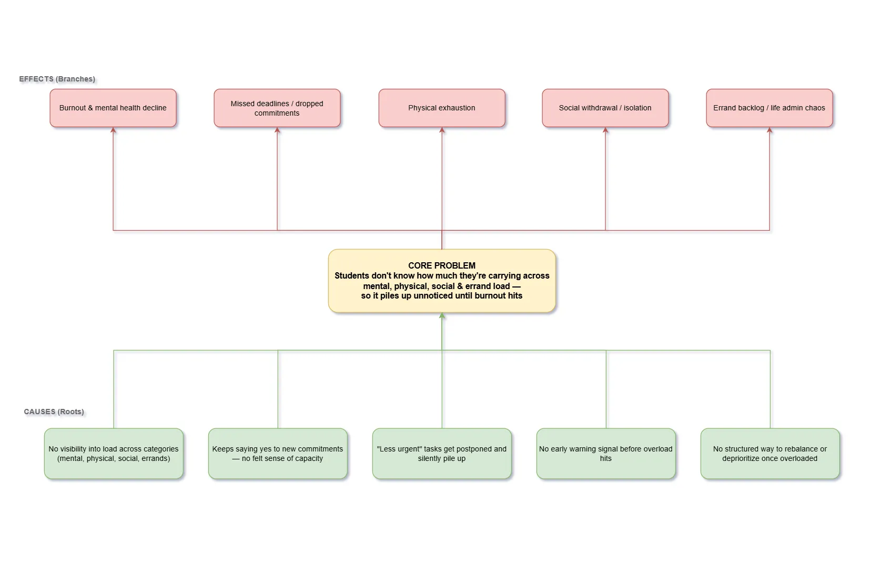
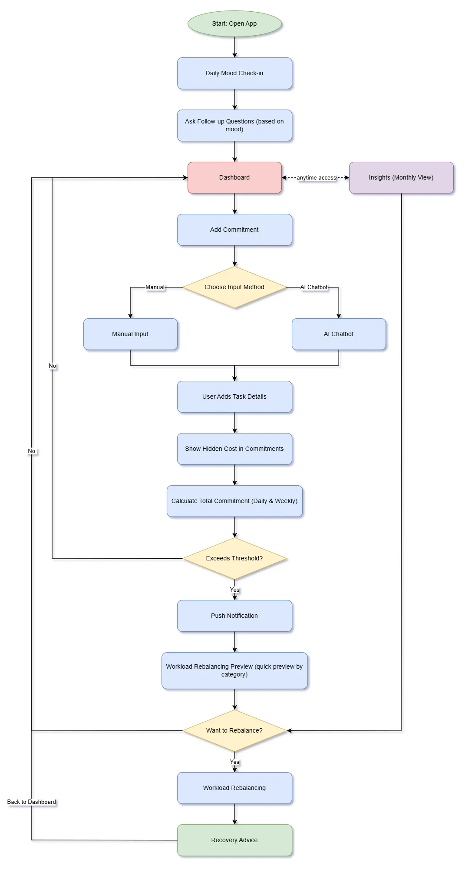
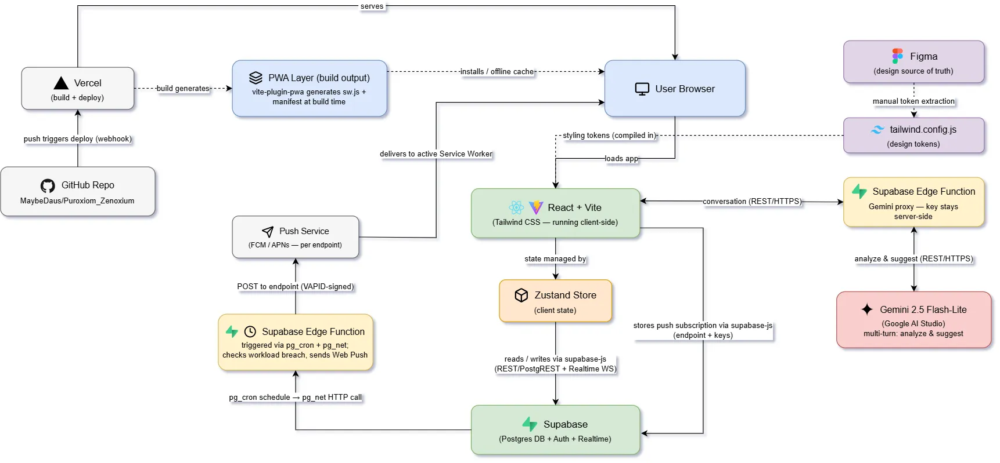

# [Zenoxium] by [Puroxiom]

**Team:** 
- Muhammad Firdaus 
- Siti Nur Syazwani Khong

- **Problem Statement:** Stress & Workload Manager
- **Video Presentation:** [Unlisted YouTube Link]
- **Presentation Slides:** (https://canva.link/21zjwz7y6t2or7j)

---

## 1. Project Overview

### Initial Problem statement

| **Problem Statement** | **Problem** | **Target Users** | **Main Idea** |
|---|---|---|---|
| **Travel Planner** | Travelers often need to manage different aspects of a trip, such as destinations, activities, schedules, and transportation, which can become difficult to organize in one place. | Travelers, especially students and young adults | A centralized travel planning tool that helps users organize their itinerary, activities, and travel arrangements efficiently. |
| **Burnout & Workload Manager** | Students often struggle to balance academic, personal, social, physical, mental, and other commitments, making it difficult to recognize when their workload becomes overwhelming. | Students | A workload management system that helps students understand their overall workload, assess the impact of new commitments, and make better decisions before becoming overwhelmed. |

> Conclusion

After comparing both problem statements, we decided to proceed with the Burnout & Workload Manager. Although the Travel Planner was practical and useful, the Burnout & Workload Manager was more relevant to students and provided greater potential for meaningful innovation.

The workload problem goes beyond simply organizing tasks because students often have to balance academic, personal, social, physical, and mental commitments simultaneously. This gave us a stronger opportunity to develop a solution that not only organizes commitments, but also analyzes workload, predicts the impact of new commitments, and provides personalized recommendations.

Therefore, we chose the Burnout & Workload Manager as our final problem statement because it has greater potential to create meaningful impact while allowing us to make effective use of AI and innovative workload-management features.

### The Problem (Stress & Workload Manager)

University students don't usually become overwhelmed by a single large responsibility; it's the accumulation of many smaller commitments (classes, assignments, club activities, errands) that gradually builds up. Individually, each commitment seems manageable, but when combined, students often don't realize how much they're carrying until they're already exhausted.

**Causes:**
- Responsibilities are scattered across different tools — a calendar for classes, a to-do list for assignments, a notes app for personal tasks, group chats for social commitments — leaving no single, clear picture of overall workload.
- New commitments are typically evaluated only against time availability ("Is Saturday free?"), not against actual capacity, so hidden costs like travel, preparation, and recovery time go unaccounted for.
- Existing tools tell students *what* they have to do and *when*, but not *whether they can realistically take on more*.

**Stakeholders:**

| Stakeholder | Role | Unmet Need |
|---|---|---|
| Students (primary) | End users | A clearer picture of their workload before committing to more |
| Academic advisors & wellness centers (secondary) | Support system | No early-warning tools to identify at-risk students before burnout occurs |

**Existing solutions:**

| App | Type | What It Does | Where It Falls Short |
|---|---|---|---|
| Notion | Productivity | All-in-one workspace for notes, tasks, and databases | General-purpose; not built around workload or capacity |
| Todoist | Productivity | Natural-language task input, recurring tasks | Tracks *what* is due, not whether the user can realistically take on more |
| Trello | Productivity | Visual board-based project management | No concept of personal capacity or burnout risk |
| Microsoft To Do | Productivity | Lightweight task manager, Outlook sync | Reminders and sync only; no workload awareness |
| Calm / Headspace | Wellness | Guided meditation, sleep content | Addresses stress symptoms after the fact, disconnected from actual task load |
| Balance | Wellness | Adaptive meditation coach | Personalizes relaxation content, not workload |
| Sanvello | Wellness | CBT-based exercises, mood tracking | Treats stress as a standalone metric, not something driven by an overloaded schedule |

**The gap:** Productivity tools optimize task execution but ignore burnout; wellness apps address stress but are blind to its cause — the workload itself. None connect *what a student is carrying* across mental, physical, social, and errand commitments to *how they're actually feeling*, or help them act on that link before burnout hits. Many advanced features are also paywalled, and general-purpose tools like Notion or Trello can overwhelm new users with unnecessary complexity.

Zenoxium's differentiation is this direct link: workload across categories → mood-adjusted capacity ceilings → rebalancing suggestions, in one lightweight PWA rather than five disconnected apps.

### Our Solution

Zenoxium is a lightweight Progressive Web App that gives students one clear picture of what they're carrying — instead of scattering it across a calendar, a to-do list, and a wellness app — and actively helps them do something about it before burnout hits.

**Core mechanics:**

| Mechanic | What It Does |
|---|---|
| Workload across four categories | Mental, Physical, Social, and Errands. Every commitment gets tagged (auto-suggested via keyword matching, AI as fallback) so load is visible by area, not one undifferentiated task list |
| Capacity, not just time | Each category has a usable-capacity ceiling that adjusts based on a daily mood check-in (Good, Tired, Too Tired, Overwhelmed), with fatigue accumulating the longer a bad mood streak continues |
| Rebalancing, not just reporting | On breach, an AI-assisted step looks at category load, breach severity, mood state, and task priority to suggest what to defer, drop, or protect |
| Recovery nudges | Soft, non-blocking push notifications pointing toward rest or a specific recovery action when thresholds are breached — never a hard stop |

This directly closes the gap named above: productivity tools track tasks but ignore capacity; wellness apps address stress symptoms but are blind to what's causing them. Zenoxium connects the two in one place a student would actually keep open on their phone.

---

## 2. Ideation & Process

### 2.1 Ideas We Considered

| Idea | Description | Option & Reason |
|---|---|---|
| **Burnout & Workload Manager** | A system designed to help students understand, manage, and balance their workload across academic, personal, physical, mental, and social commitments. | **Kept** — Directly addresses student burnout and provides strong opportunities for AI integration, workload analysis, prediction, and personalized recommendations. |
| **AI Commitment Analyzer** | Uses AI to analyze a new commitment and identify its hidden time, effort, and workload impact before the user accepts it. | **Kept** — Supports the main problem by helping users understand the actual impact of new commitments before making decisions. |
| **What-If Workload Simulation** | Allows users to see how adding a new commitment could affect their existing workload and whether the overall workload remains manageable. | **Kept** — Adds a predictive element to the system and helps users make informed decisions before accepting new commitments. |
| **Recovery Recommendation System** | Provides recommendations when the user's workload becomes too high, helping them identify suitable ways to recover and manage their commitments. | **Kept** — Complements workload analysis by providing actionable support when the user's workload reaches a high level. |
| **Mood Check-In** | Allows users to record their current mood so the system can consider their emotional state alongside their workload. | **Kept** — Adds emotional context and allows the system to provide more personalized workload and recovery recommendations. |
| **Calendar Import** | Allows users to import their existing calendar events and commitments into the app so their workload can be analyzed without manually entering everything. | **Kept** — Reduces the effort required to set up the system and allows existing commitments to be incorporated into workload analysis. |
| **Burnout Risk / Workload Threshold** | Uses workload levels to identify when a user's commitments may be becoming difficult to manage and provides a warning when a threshold is reached. | **Kept** — Makes the system proactive rather than simply displaying tasks, allowing users to recognize potential overload before it becomes more serious. |
| **Insights Dashboard** | Provides an overview of workload by category and priority, allowing users to understand where most of their time and effort is being spent. | **Kept** — Helps users identify workload patterns and make better decisions about how they manage their commitments. |
| **Travel Planner** | A planning system that helps users organize trips, including schedules, activities, and travel arrangements. | **Dropped** — Although useful and practical, it was less relevant to the team's focus and offered less opportunity to address the issue of student burnout and workload management. |
| **Simple To-Do List** | A basic task-management system for recording and organizing tasks and deadlines. | **Dropped** — Too similar to existing task-management applications and does not address the underlying problem of workload overload or burnout. |
| **Study Planner** | A planner focused mainly on organizing study sessions, academic tasks, and examination preparation. | **Dropped** — Focuses mainly on academic responsibilities and does not account for other sources of workload such as social, physical, mental, and personal commitments. |
| **Flexible Workload Categories** | Allows users to create their own workload categories based on their personal needs. | **Dropped** — Although it increases customization, unrestricted categories may cause inconsistent classification, increase system complexity, and reduce the reliability of workload analysis and AI recommendations. |
| **AI Academic Note Summarizer & Quiz Generator** | Uses AI to summarize academic notes and generate quizzes to support students in their studies. | **Dropped** — Useful for academic support, but it solves a study-assistance problem rather than the central workload and burnout problem. |
| **Habit Tracker** | Helps users track and maintain personal habits and routines over time. | **Dropped** — Useful for personal development, but it does not directly address workload management or the competing commitments that contribute to burnout. |

### 2.2 Ideation Boards

#### Problem Tree

#### User Flow

#### SCAMPER Model

#### Mindmap Features

### 2.3 Mentor Consultation

| Date | Mentor | Feedback Received | What Was Changed |
| :--- | :--- | :--- | :--- |
| **6/9/2026** | **Faris Aiman** | • Prompt asking the threshold percentage  • Prompt asking personal preferences (e.g., how long does it take for you to reach your destination, etc.)  • Add due date button  • Add hidden cost features so users can enter information in the add commitment page  • Connect to calendar | • Will be added as a prompt when the user first installs the app.  • Will be added as a prompt when the user first installs the app.  • Due date button is added in the 'Add Commitment' page.  • The idea is taken but modified into one dedicated page to show overall commitment costs. Commitment cost is also automatically estimated by AI or entered by the user upon first installation.  • Will be added as a feature during initial setup when the user first installs the app. |
| **6/9/2026** | **Zach Khong** | • Categories shouldn't be fixed  • Reduce input friction when adding a commitment  • Hidden cost estimation should be simpler  • Simulation shouldn't be a separate, optional step  • Workload rebalancing should also be automatic/reactive, not a manual step  • Overall UX philosophy: "active," not "passive"  • Accessibility suggestions | • The suggestion is not implemented due to the risk of excessive category creation, which could make the app heavy and increase the likelihood of system errors.  • AI chatbot feature is added so the user can list out all tasks in plain language before being processed by AI.  • A separate "hidden commitment costs page" is added so users can see the overall commitment costs clearly.  • The option for manual simulation is removed and integrated directly into the fixed system flow.  • A push notification is added to alert the user if their workload is overloaded, and workload rebalancing is set as part of the fixed flow.  • AI will periodically calculate the overall workload and alert the user if it's overloaded so users can take immediate action.  • A home screen widget will be added in future iterations to allow users to access the app easily. |

---

## 3. Design & Prototype

**UI Prototype:** https://www.figma.com/design/dPWkejPgv4R6o737HRBrlx/ZENOXIUM?node-id=0-1&t=IVfGzySWMFWpZd5D-1

---

## 4. What Makes It Different

Zenoxium is different from conventional productivity and wellness applications because it does not treat task management and well-being as separate problems. Instead, it connects a student's commitments, workload, and current state to help them understand whether taking on something new is realistic.

### 4.1 Novel Features

| **Feature** | **What Makes It Different** |
|---|---|
| **AI Commitment Analyzer** | Instead of simply adding a task to a to-do list, Zenoxium analyzes a new commitment and identifies its potential hidden time and effort requirements before the user accepts it. |
| **What-If Workload Simulation** | Users can see the potential impact of a new commitment before committing to it. The system evaluates how the additional commitment could affect their existing workload and whether it remains manageable. |
| **Cross-Category Workload Analysis** | Unlike conventional productivity apps that mainly focus on tasks, Zenoxium considers different types of commitments, including time, mental, physical, errands, and social workload. |
| **Workload Threshold Alerts** | Rather than only reminding users about deadlines, Zenoxium identifies when their overall workload reaches a high level and provides an early warning before they become overwhelmed. |
| **Mood + Workload Connection** | Zenoxium combines the user's mood check-in with workload information, allowing users to view their workload alongside how they are feeling rather than treating emotional well-being as a separate issue. |
| **Calendar Import** | Users can import existing calendar commitments instead of manually entering everything. This allows Zenoxium to analyze commitments that are already part of their schedule and provide a more complete picture of their workload. |
| **Recovery Recommendations** | When workload becomes high, Zenoxium does not simply display a warning. It provides recovery suggestions based on the user's current situation, making the system more action-oriented. |
| **Workload Insights** | The system converts commitments into understandable insights by showing workload across different categories and priorities, helping users identify where their workload is concentrated. |

### 4.2 The Core Difference

Most productivity tools answer:

> **"What do I need to do?"**

Zenoxium aims to answer:

> **"Can I realistically take this on?"**

Instead of simply helping students organize more tasks, Zenoxium helps them understand the impact of their commitments before adding more.

### 4.3 Comparison with Existing Solutions

| **Existing Solution** | **Main Focus** | **Limitation** | **Zenoxium's Difference** |
|---|---|---|---|
| **Notion** | Notes, tasks, and databases | General-purpose and requires users to build their own system | Provides a focused workload-management system designed around student commitments and capacity. |
| **Todoist** | Tasks and deadlines | Focuses on what needs to be completed rather than whether the user can realistically take on more | AI analyzes the potential workload impact of a new commitment before it is accepted. |
| **Trello** | Project and task organization | No personal workload or burnout awareness | Evaluates workload across multiple categories and provides threshold alerts. |
| **Microsoft To Do** | Tasks, reminders, and synchronization | Primarily focuses on task completion and reminders | Connects existing commitments with workload analysis and what-if simulation. |
| **Calm / Headspace** | Meditation and relaxation | Addresses stress mainly through wellness activities | Connects well-being with the workload that may be contributing to stress. |
| **Balance** | Personalized meditation | Focuses on relaxation rather than workload | Uses workload information alongside mood to provide more contextual support. |
| **Sanvello** | Mood tracking and mental wellness | Treats stress and mood largely as separate wellness metrics | Connects mood information with actual workload and commitments. |

### 4.4 The Gap We Address

Existing productivity applications are effective at helping users organize and complete tasks, while wellness applications focus on managing stress and improving well-being. However, these two areas are usually separated.

Zenoxium bridges this gap by connecting:

**Existing Commitments**  
↓  
**Workload Across Different Categories**  
↓  
**Current Mood and State**  
↓  
**AI Analysis of New Commitments**  
↓  
**What-If Workload Simulation**  
↓  
**Early Workload Warning**  
↓  
**Actionable Recommendations**

This means Zenoxium is not simply another to-do list or wellness application. Its main difference is that it helps students understand the relationship between what they are carrying and whether they can realistically take on more.

> **Zenoxium doesn't just help students manage their tasks — it helps them decide whether they have the capacity to take on more.**

---

## 5. Technical Architecture & Feasibility

### Tech Stack

#### Frontend

| Tool | Why We Chose It | Constraint |
|---|---|---|
| **React + Vite** | Fast dev-server startup and hot reload, which matters given our build window. | — |
| **Tailwind CSS** | Lets us pull design tokens directly from Figma (our source of truth) into `tailwind.config.js`, keeping styling consistent without a separate design system. | Token sync between Figma and Tailwind is currently manual — a design change requires us to re-extract and update the config by hand. No automated pipeline for this yet. |
| **vite-plugin-pwa** | Packages the app as an installable Progressive Web App (service worker, manifest, offline cache) without needing a native app store submission — directly addresses the problem statement's requirement that the app be "something students would actually keep open on their phone." | Offline support only covers cached UI/static assets; any feature that depends on a live Supabase connection (workload data, AI suggestions) still requires network access. |
| **Zustand** | Lightweight state management for client-side app state (mood, commitments, UI state) without Redux's boilerplate. | No built-in devtools/persistence middleware configured yet — state resets on full page reload unless we wire this up. |

#### Backend / Database

| Tool | Why We Chose It | Constraint |
|---|---|---|
| **Supabase (Postgres + Auth + Realtime)** | Gives us a managed Postgres database, authentication, and realtime subscriptions in one free-tier service, avoiding separate infrastructure for each. | Free tier pauses inactive projects and has row/bandwidth limits — not a production guarantee. Also can't run arbitrary server-side logic directly against the DB, which is why we use Edge Functions for anything beyond CRUD. |
| **Supabase Edge Functions** | Used for two things: (1) proxying AI calls so the Gemini API key stays server-side and never reaches the browser, (2) a scheduled `pg_cron` job that checks workload against each user's capacity and triggers push notifications. | Edge Functions run on Deno, not Node — some npm packages aren't directly compatible, so we check compatibility before depending on any library there. |

#### AI / APIs

| Tool | Why We Chose It | Constraint |
|---|---|---|
| **Gemini 2.5 Flash-Lite** (Google AI Studio) | Scoped to three functions where judgment/NLG genuinely adds value: Workload Rebalancing suggestions, personalized advice (from mood + schedule + workload together), and hidden-cost detection (flags time/energy costs in a commitment's notes that the user likely underestimated). Everything else (category tagging, capacity math, breach detection) runs on deterministic logic. Free-tier and fast enough for this use case. | Free-tier requests are rate-limited. Multi-turn coherence across a conversation (e.g. a rebalancing chat) is a known risk — mitigated by progressively summarizing confirmed slots into the system prompt rather than replaying full history. |
| **Web Push (VAPID)** | Used for workload-breach nudges, sent from the `pg_cron` Edge Function independent of whether the app is open. | Requires explicit browser permission and doesn't work identically across all browsers/OSes (notably iOS Safari has partial/late support). |

#### Hosting / Deployment

| Tool | Why We Chose It | Constraint |
|---|---|---|
| **Vercel** | Connected to our GitHub repo (`MaybeDaus/Puroxiom_Zenoxium`) with auto-deploy on push. | Frontend only — Supabase and its Edge Functions are hosted and deployed separately, so a full deploy involves two systems rather than one. |

#### Design

| Tool | Why We Chose It | Constraint |
|---|---|---|
| **Figma** | Source of truth for all screens and design tokens, referenced during frontend implementation. | — |

### System Architecture Diagram

### Build Plan & Scope

| Phase | Scope |
|---|---|
| **Phase 1 — Core data & logic** (deterministic, no AI) | Supabase schema (users, commitments, mood check-ins, category tags) · Commitment CRUD wired to Dashboard · Daily workload check (19h/day ceiling) + weekly workload check (133h/week), both mood-adjusted per the streak-decay model · Category auto-tagging via keyword matching (Gemini fallback only on no-match) |
| **Phase 2 — Notifications & AI-backed features** | `pg_cron` Edge Function for breach detection + Web Push delivery · Gemini-backed functions via proxy Edge Function: Workload Rebalancing suggestions, general advice, hidden-cost detection |
| **Phase 3 — Polish** | Monthly calendar view · Insights screen · Simulation screen (client-side only) |

**Explicitly out of scope for this build window:**

- Multi-device sync beyond what Supabase Realtime gives us by default
- Native mobile apps (PWA only)
- Any AI feature beyond Rebalancing suggestions, general advice, and hidden-cost detection
- Automated Figma → Tailwind token sync
